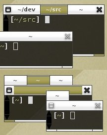
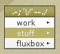
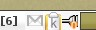

# Fluxbox' featurelist.

Some of the main features lay under the hood and might not seem to be obvious
at first glance.

## APPS-FILE

One of the most underestimated - although one of the most powerful features -
is the apps-file. With this file it is possible to set application-specific
parameters for dimension, decoration, default workspace to open on, stickyness
and much more. It will let you manipulate almost every setting for any window
or application. The best way to learn about it is to visit the wiki-site for
the apps-file.

## KEYS-FILE

The keys-file does not only provide comfort to people who have no mouse, it
also makes working more comfortable for all users. Setting up a proper
keys-file lets you control almost everything and is a lot faster than from
using a menu with only keys, key.combinations and key-chains. People who do
not like to raise their hands from the keyboard to grab the mouse and people
who do not let lose their rodent will love the keys-file for being fully
customizable to one's needs and workflow. Learn more about the keys-file in
the wiki.

## TABS

Tabbing is a nice feature that allows you to tab windows together. This can be
combined with the "autogrouping" feature that is provided via the apps-file.
This will make certain applications tab together by default.

Tabs can eiher be embedded into the window's titlebar as shown in the upper
screenshot or they can appear as little tabs at the outside of a window such
as the lower example. The position and size of the outside-tabs is
customizable.

## SLIT

The Slit is often confused with the toolbar. The slit is a dock for any
application that can be 'dockable'. A docked application is anchored and
appears on every workspace. It cannot be moved freely and is not influenced by
any manipulation to windows. Typical programs that go into the slit are
dockapps or gkrellm. The latter one is shown in the litte example shot.

## ROOT-MENU

The Root-Menu is the menu that appears on a right click on the desktop. It is
fully customizable and implies a lot of native features such as a
configure-menu, a style-menu, and many custom menus can be used and included.
Learn more about the menu-file in the wiki.

## TOOLBAR

The Toolbar is the bar down at the bottom by default that shows all the
windows on the desktop. According to its configuration the user can define
what windows are shown. It also contains helpful tools such as the current
workspace-name, a clock, the systemtray and some buttons to switch between
workspaces/windows. Learn how to customize the toolbar

## SYSTEMTRAY

The Systemtray is a little tool of the toolbar that can pick up applications
that provide such feature. Applications sit as little icons in the systemtray.

